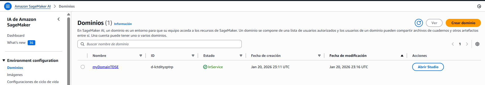
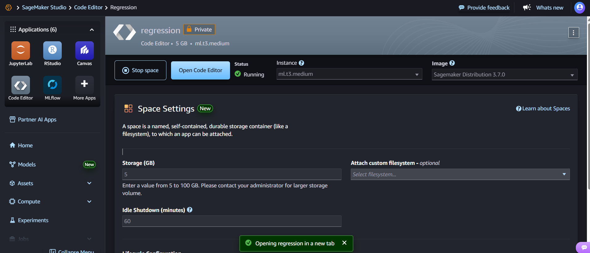
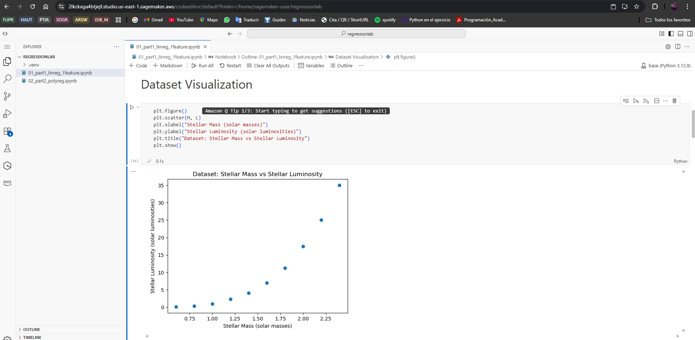
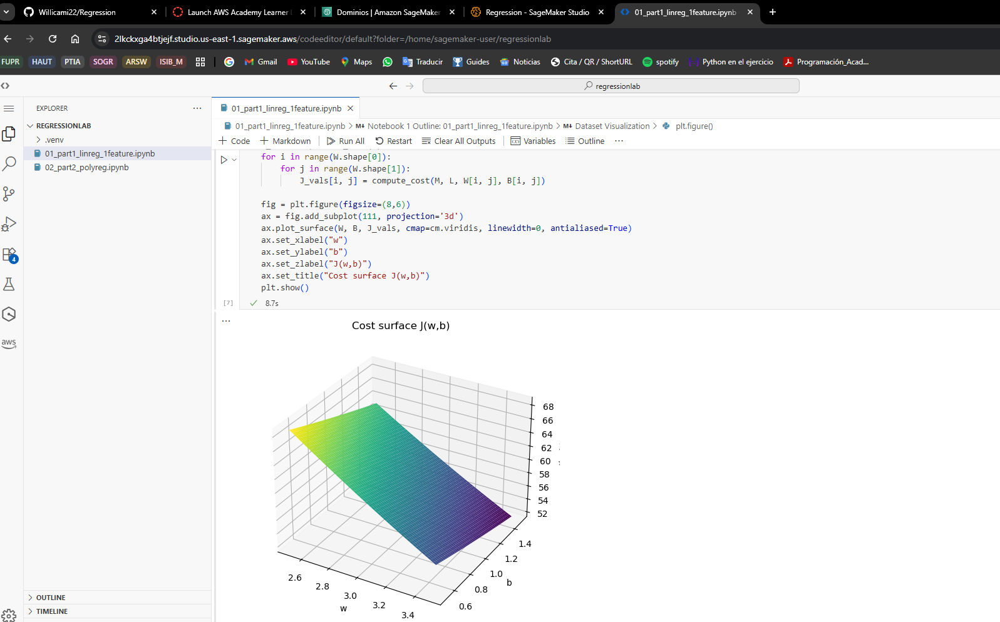
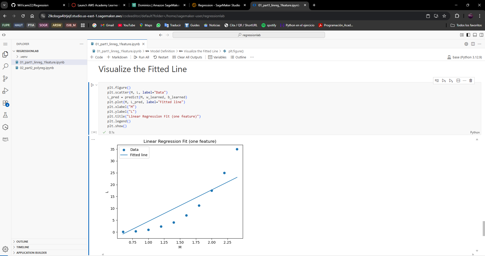
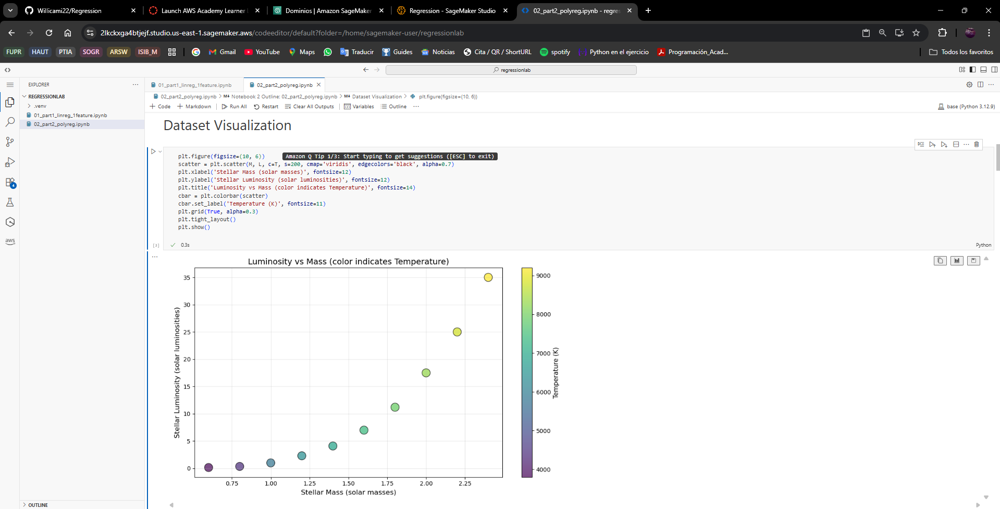
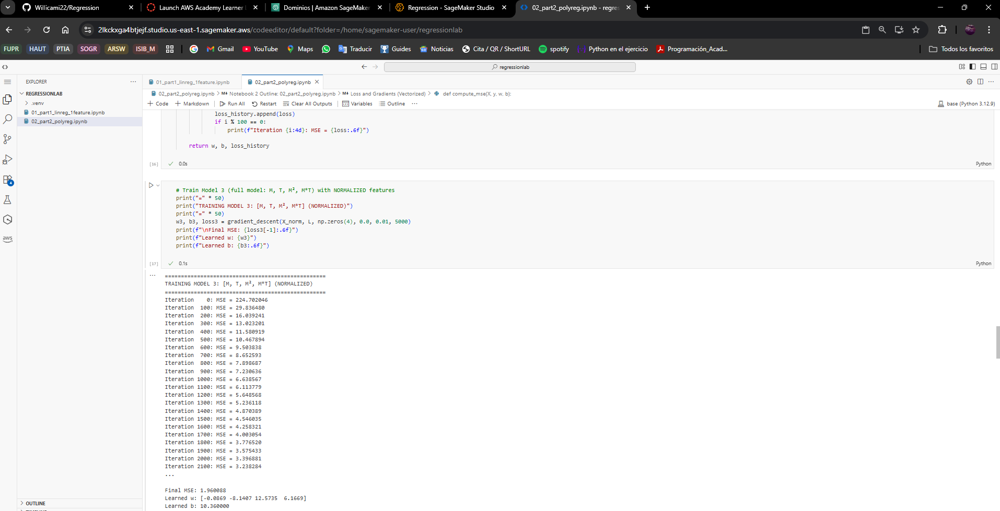
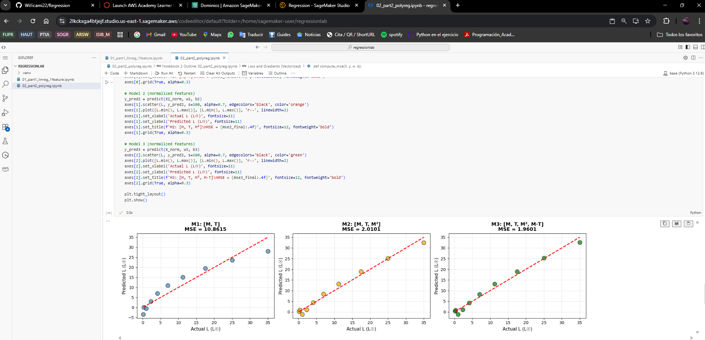

# Stellar Luminosity Regression: Cloud-Ready AI Infrastructure

A comprehensive implementation of linear and polynomial regression algorithms from first principles, demonstrating fundamental machine learning concepts and cloud deployment readiness. This project models stellar luminosity as a function of mass and temperature, implementing cost functions, gradient descent optimization, and feature engineering without relying on high-level ML frameworks. Designed for educational purposes and cloud execution on AWS SageMaker.

---

## Getting Started

These instructions will get you a copy of the project up and running on your local machine for development and testing purposes. See the AWS SageMaker deployment section for notes on how to deploy the project on a cloud environment.

### Prerequisites

To run this project locally, you need:

**Python 3.8 or higher**
```bash
python --version
# Should output: Python 3.8.x or higher
```

**Required Python packages:**
```bash
numpy>=1.21.0
matplotlib>=3.4.0
pandas>=1.3.0
jupyter>=1.0.0
```

**For AWS SageMaker deployment:**
- Active AWS Account
- AWS SageMaker Studio access
- Basic knowledge of Jupyter notebooks

### Installing

Follow these steps to set up your development environment:

**1. Clone the repository**
```bash
git clone https://github.com/yourusername/stellar-luminosity-regression.git
cd stellar-luminosity-regression
```

**2. Create a virtual environment (recommended)**
```bash
python -m venv .venv
```

**3. Activate the virtual environment**

On Windows:
```bash
.venv\Scripts\activate
```

On macOS/Linux:
```bash
source .venv/bin/activate
```

**4. Install dependencies**
```bash
pip install numpy pandas matplotlib jupyter
```

**5. Launch Jupyter Notebook**
```bash
jupyter notebook
```

**6. Open and run the notebooks**
- Navigate to `01_part1_linreg_1feature.ipynb` for linear regression
- Navigate to `02_part2_polyreg.ipynb` for polynomial regression

---

## Running the Notebooks

### Local Execution

After installation, execute the notebooks in order:

**Notebook 1: Linear Regression (Single Feature)**
```bash
jupyter notebook 01_part1_linreg_1feature.ipynb
```

Run all cells sequentially to:
- Visualize the M vs L relationship
- Compute cost surface and gradients
- Train the model using gradient descent
- Analyze convergence behavior
- Evaluate model performance

**Notebook 2: Polynomial Regression (Multiple Features)**
```bash
jupyter notebook 02_part2_polyreg.ipynb
```

Run all cells to:
- Compare 3 different feature combinations
- Analyze interaction term importance
- Perform inference on new data
- Visualize predicted vs actual results

---

## AWS SageMaker Execution Evidence

### Deployment Process

The notebooks were successfully deployed and executed on **AWS SageMaker Studio** following these steps:

1. **Access SageMaker Studio** via AWS Console
2. **Create Notebook Instance** with ml.t3.medium configuration
3. **Upload Notebooks** (`01_part1_linreg_1feature.ipynb` and `02_part2_polyreg.ipynb`)
4. **Execute All Cells** in sequential order
5. **Verify Outputs** including plots and numerical results

### Screenshots

Below are screenshots demonstrating successful cloud execution:

**Figure 1: Both Notebooks Open in SageMaker Studio**



*Shows both notebooks visible in the SageMaker file browser and workspace.*

---

**Figure 2: Notebook 1 - Successful Execution**



*Demonstrates all cells executed successfully with visible outputs in `01_part1_linreg_1feature.ipynb`.*

---

**Figure 3: Cost Surface Visualization in SageMaker**



*3D cost surface and contour plots rendered correctly in the cloud environment.*

---

**Figure 4: Gradient Descent Convergence**



*Loss vs Iterations plot showing successful model training and convergence.*

---

**Figure 5: Notebook 2 - Feature Comparison Results**



*Side-by-side comparison of three models with different feature sets.*

---

**Figure 6: Polynomial Regression Training Output**



*Training logs showing MSE reduction across 5000 iterations with normalized features.*

---

**Figure 7: Sensitivity Analysis Plot**



*Cost vs Interaction Term (w_MT) showing the importance of the M·T feature.*

---

**Figure 8: Inference Demo Results**



*Prediction for new star (M=1.3, T=6600) with reasonableness validation.*

---

### Local vs SageMaker Execution Comparison

| Aspect | Local Execution | AWS SageMaker Execution |
|--------|----------------|-------------------------|
| **Setup Time** | ~5 minutes (env setup) | ~2 minutes (instance ready) |
| **Numerical Results** | Identical MSE values | Identical MSE values |
| **Execution Speed** | Comparable | Comparable (ml.t3.medium) |
| **Plot Rendering** | Inline in Jupyter | Inline in SageMaker Studio |
| **Reproducibility** | Depends on local Python version | Guaranteed (containerized env) |
| **Scalability** | Limited by local hardware | Can scale to GPU instances |
| **Collaboration** | Manual file sharing | Built-in sharing features |
| **Cost** | $0 (local resources) | ~$0.05/hour (ml.t3.medium) |

**Key Observations:**
-  **No code modifications** required for cloud deployment
-  **Identical numerical results** across environments
-  **All visualizations render correctly** in SageMaker Studio
-  **Cloud execution reinforces enterprise scalability** mindset
-  **SageMaker provides better reproducibility** through managed environments

---

## Dataset Description

### Part I: Single Feature Linear Regression

Modeling luminosity (L) as a function of stellar mass (M):

| Mass (M) | Luminosity (L) |
|-----------|-----------------|
| 0.6 | 0.15 |
| 0.8 | 0.35 |
| 1.0 | 1.00 |
| 1.2 | 2.30 |
| 1.4 | 4.10 |
| 1.6 | 7.00 |
| 1.8 | 11.2 |
| 2.0 | 17.5 |
| 2.2 | 25.0 |
| 2.4 | 35.0 |

**Model**: L̂ = wM + b

---

### Part II: Multiple Feature Polynomial Regression

Modeling luminosity as a function of mass (M) and temperature (T):

| Mass (M) | Temperature (K) | Luminosity (L) |
|-----------|----------------|-----------------|
| 0.6 | 3800 | 0.15 |
| 0.8 | 4400 | 0.35 |
| 1.0 | 5800 | 1.00 |
| 1.2 | 6400 | 2.30 |
| 1.4 | 6900 | 4.10 |
| 1.6 | 7400 | 7.00 |
| 1.8 | 7900 | 11.2 |
| 2.0 | 8300 | 17.5 |
| 2.2 | 8800 | 25.0 |
| 2.4 | 9200 | 35.0 |

**Feature Engineering**: X = [M, T, M², M·T]

**Model**: L̂ = Xw + b

---

## Built With

* **[NumPy](https://numpy.org/)** - Numerical computing and vectorized operations
* **[Matplotlib](https://matplotlib.org/)** - Data visualization and plotting
* **[Pandas](https://pandas.pydata.org/)** - Data structure and analysis (optional)
* **[Jupyter](https://jupyter.org/)** - Interactive notebook environment
* **[AWS SageMaker](https://aws.amazon.com/sagemaker/)** - Cloud-based ML platform for deployment

---

## Authors

* **William Camilo Hernandez Deaza** - *Initial work and implementation*
  - Escuela Colombiana de Ingeniería Julio Garavito
  - Transformación Digital y Soluciones Empresariales - TDSE-2

See also the list of [contributors](https://github.com/yourusername/stellar-luminosity-regression/contributors) who participated in this project.

---

## License

This project is licensed under the MIT License - see the [LICENSE.md](LICENSE.md) file for details.

---
